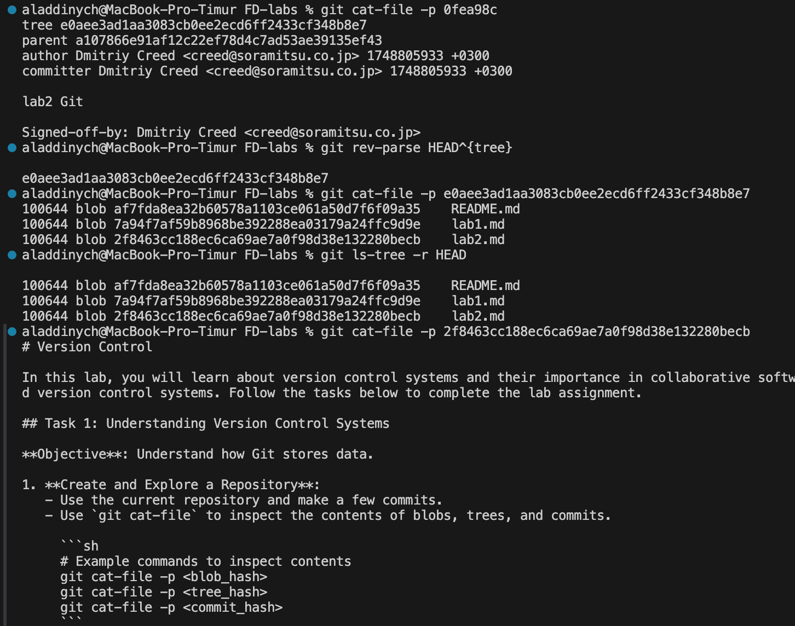

# Task 1 -- ssh commit signature verification

## 1 Benefits of Signing Commits

In short: signing commits keeps things secure and trustworthy in Git.

Signing commits is basically putting a digital stamp on your code using a GPG, SSH, or S/MIME key.

SSH is the easiest -- you just point Git at your public key. GPG takes a bit more work, and S/MIME is usually for bigger orgs. Once you push to GitHub or Bitbucket, any commit with a valid signature gets a Verified badge so everyone knows it's legit. Even if you rotate or revoke your key, GitHub keeps a permanent record of this original verification, so the commit stays trusted.

Signed commits build trust in teams and opensource projects -- because you can enforce it so that only the signed commits are allowed on protected branches. And since only you have your private key, you can't say, "that wasn't me". Signed commits help to know exactly who made each change, and the repo can block anything that isn't verified.

## 2 Set up SSH Commit signing

pubkey: `ssh-ed25519 AAAAC3NzaC1lZDI1NTE5AAAAIB67Ef.../QMwAzZpGnN.../TR... decter49pro@gmail.com`

Didn't work for the 1st commit, so I'm trying again.

Then i realized that the SSH key i provided on GH was actually for auth, not signing :>

# Task 2 -- merge strategies

## 1 Research Merge Strategies

Standard merge keeps all individual commits and adds a merge commit—this is great for preserving history and seeing exactly when branches combined.

Squash-and-merge smooshes all feature-branch commits into one single commit on the main branch, makes the log cleaner but loses the details, the commit history.

\+ if you need to revert just the merge, you can do that easily with a single command.

\+ merge commit shows exactly when branches joined.

\- extra Merge branch.. noise in the log.

\- if you merge a feature that turned out to be problematic, you've still brought in every little intermediate commit.

Rebase-and-merge puts in the original order each commit onto the top of the branch you're merging into without a merge commit, giving you a linear history but rewriting the branch's history in the process, which can confuse teammates.

\+ Collapses all feature commits into one, making the main branch history clean.

\+ Lets you write a single summary message for the entire feature.

\- Loses details of the history.

\- Harder to trace exactly how a specific bug was fixed inside the feature.

I would say, most teams prefer standard merge because it's safe, shows full context and avoids rewriting history. But I've also seen squash-and-merge strategy used extensively. Depends on the team's preference.

\+ Produces a straight-line history without merge commits.

\+ Keeps individual commits, so you still see each change.

\+ If you rebase often, conflicts happen incrementally rather than all at once.

\- Rewrites branch history, confuses teammates who have the old branch.

\- Anyone who already pulled the feature branch has to force-pull or rebase themselves, they risk losing the work they've done.

## 2 Modify Repository Settings

